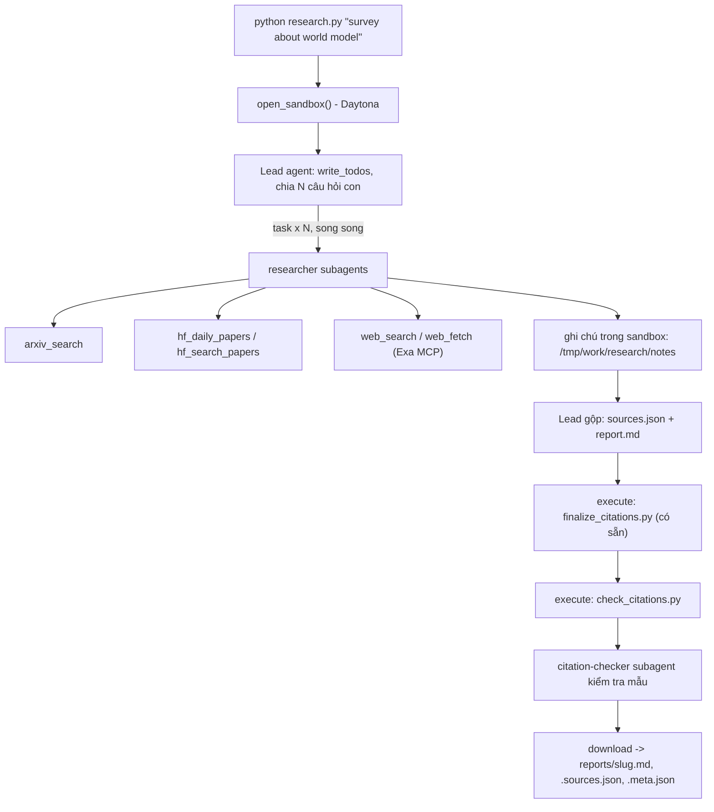

# Deep Research Agent (Deep Agents + Sandbox)

## Chạy bản đã hoàn thiện trên Windows / Docker WSL

Hệ thống đã cài đặt 5 công cụ nguồn, retry/backoff, lead và researcher song song,
kiểm tra trích dẫn trong sandbox và xuất metadata. Không cần tài khoản Daytona
khi dùng `SANDBOX=docker`. Giữ nguyên các tệp có sẵn `model.py`, `sandbox.py`,
`finalize_citations.py` và `self_check.py`.

Trong PowerShell tại thư mục dự án:

```powershell
python -m venv .venv
.\.venv\Scripts\python.exe -m pip install -r requirements.txt
# Chỉ copy khi CHƯA có .env; không ghi đè key đã cấu hình.
if (-not (Test-Path .env)) { Copy-Item .env.example .env }
```

Điền key của bạn vào `.env`. Ví dụ dùng Google AI Studio:

```dotenv
LAB_MODEL=google_genai:<tên-model-hỗ-trợ-tool-calling>
GOOGLE_API_KEY=<key-của-bạn>
EXA_API_KEY=<key-của-bạn>
SANDBOX=docker
LAB_TOKEN_BUDGET=1500000
```

`LAB_MODEL` phải đúng tên model được tài khoản của bạn hỗ trợ. Nếu dùng endpoint
tương thích OpenAI, thay bằng `LAB_BASE_URL`, `LAB_MODEL` và `LAB_API_KEY` theo
`.env.example`. Không đưa `.env` hoặc key vào git, sandbox hay báo cáo.

Docker CLI có thể nằm trong Windows hoặc WSL. Nếu Windows không có Docker,
`research.py` tự gọi `wsl.exe --exec docker` trong distro WSL mặc định; không cần
Docker Desktop. Kiểm tra engine trước: `wsl.exe --exec docker info`. Container
phải dùng image có `python3` và `bash`; mặc định `python:3.12-slim`, mạng bị tắt.
Chương trình giữ một tiến trình WSL đọc stdin trong thời gian sandbox hoạt động,
tránh WSL tự tắt khi chờ quota API lâu; tiến trình này được đóng sau khi dọn container.

```powershell
# Kiểm thử offline, không tốn token:
.\.venv\Scripts\python.exe -m unittest discover -s tests -v
# Kiểm tra dữ liệu nguồn thật (gọi mạng):
.\.venv\Scripts\python.exe tools.py
# Chạy một chủ đề (tốn token LLM):
.\.venv\Scripts\python.exe research.py "survey about world model"
# Chạy đủ 5 chủ đề; bỏ qua kết quả cũ khi đã qua kiểm tra:
.\.venv\Scripts\python.exe research.py --all --skip-existing
.\.venv\Scripts\python.exe self_check.py
```

Mỗi chủ đề tạo `reports/<slug>.md` (báo cáo tiếng Anh), `.sources.json` (nguồn),
`.meta.json` (model, thời gian, số task/tool, token, họ nguồn) và `.audit.md`
(đối chiếu khẳng định của citation-checker). Báo cáo và nguồn giữ đúng bytes
tải về từ sandbox. Finalizer và validator đều chạy trong sandbox. Chỉ lưu khi
trích dẫn hợp lệ, có ít nhất 3 task, 3 họ nguồn và tệp audit; thất bại trả mã 1.
Không sửa tay báo cáo: sửa prompt/mã rồi chạy lại.

### Phần mở rộng đã thực hiện

- Giới hạn model/tool cho lead, researcher, citation-checker và helper mặc định,
  gồm `run_limit`, `thread_limit`, cùng `recursion_limit=1000` cho lead.
- `budget.py` đếm token dùng chung giữa lead và subagent bằng khóa luồng, đặt
  chỗ trước mỗi lượt gọi song song, cảnh báo ở 80% và từ chối gọi khi hết chỗ.
  Metadata có `shared_token_budget`, gồm cả subagent; trường `tokens` gốc chỉ
  đếm tin nhắn lead theo yêu cầu lab. Lượt thiếu usage dùng ước lượng bảo thủ.
  Bộ đếm middleware không tính lượt nén ngữ cảnh nội bộ của Deep Agents.
  Đây là giới hạn chống chạy quá lâu; token thực tế có thể vượt ước lượng của
  một lượt đang chạy và không phải cam kết chi phí nhà cung cấp.
- Các agent dùng chung bộ điều tiết lượt gọi LLM. Với Gemini, mặc định giãn
  5 giây giữa các lượt gọi; điều chỉnh bằng `LAB_MODEL_INTERVAL`. Bộ điều tiết
  token/phút dùng ước lượng đầu vào, mặc định Gemini 200000, chỉnh bằng
  `LAB_MODEL_TPM`; quota thực tế vẫn do nhà cung cấp quyết định. Lỗi mạng và
  429/5xx được retry có giới hạn, tôn trọng thời gian chờ khi có; 400/401 không retry.
  Gemini dùng timeout 120 giây/lượt và tắt retry nội bộ của SDK để không chồng
  lên retry của middleware.
  Hết quota ngày sẽ dừng ngay; có thể chọn model khác còn quota hoặc chạy lại
  sau khi quota được đặt lại, giữ nguyên key và các báo cáo đã hợp lệ.
  Chạy batch và sửa báo cáo lần lượt để tránh nhiều tiến trình cùng vượt quota.
- Có lệnh chạy batch và tiếp tục bằng `--skip-existing`; các tệp đầu ra được
  kiểm tra trước khi ghi, ghi qua staging và khôi phục nếu ghi thất bại.
- `normalize_headings.py` chuẩn hóa tiêu đề mục của mẫu trong sandbox trước
  finalizer/validator; không sửa nội dung phân tích. Gate cuối cũng kiểm tra
  3–6 phần chủ đề và quan hệ giữa họ nguồn, ID và URL.
- Gate audit yêu cầu ít nhất 5 kết luận trên ít nhất 3 URL nguồn, đồng thời
  kiểm tra các URL đó đã được `web_fetch` gọi trong lượt chạy. Đây là bằng chứng
  đã truy cập nguồn; việc khẳng định có được nguồn hỗ trợ vẫn cần đối chiếu nội dung.
- Quy trình tách lấy nguồn và viết báo cáo thành hai giai đoạn. Callback ghi nhận
  metadata thực tế từ arXiv/HF vào ledger; gate từ chối URL không được truy xuất
  hoặc ID, tiêu đề, ngày bị thay đổi. URL web phải có trong kết quả search/fetch
  thành công. Script validator/finalizer được tải lại từ host trước gate cuối,
  tránh chấp nhận kết quả từ script do agent vô tình sửa trong sandbox.

Khi kiểm tra nguồn phát hiện lỗi nội dung, có thể yêu cầu hệ thống sửa trong
sandbox bằng `repair_report.py "<topic>" --instructions "<lỗi đã đối chiếu>"`.
Lượt sửa giữ metadata gốc trong `generation_metadata`, cộng số task/tool/token
thực tế và ghi `repair_runs`; báo cáo được finalizer và validator kiểm tra lại
trước khi tải về. Đây không phải thao tác sửa tay báo cáo trên host.
Có thể thêm `--editor-model google_genai:<model>` để dùng một model Google khác
cho editor, trong khi researcher/checker vẫn dùng `LAB_MODEL`; metadata ghi cả hai.

Các mở rộng trong GUIDE là tùy chọn, không có điểm bonus riêng. Bộ nhớ dài hạn
và công cụ nén chủ động chưa bật; Deep Agents vẫn có cơ chế tóm tắt mặc định.
Tài liệu tham chiếu: [Deep Agents subagents](https://docs.langchain.com/oss/python/deepagents/subagents)
và [Exa MCP](https://exa.ai/docs/get-started/exa-mcp).

---

Lab dựng một **hệ thống deep research đa tác tử**: người dùng chỉ cần nhập một chủ đề (ví dụ `survey about world model`), hệ thống tự lập kế hoạch, giao việc cho nhiều subagent, tìm tài liệu trên arXiv, Hugging Face và web, rồi viết một **báo cáo có trích dẫn**.

Hình thức: **bài thực hành cá nhân**. Ngôn ngữ lập trình: Python 3.11 trở lên.

## 1. Mục tiêu học tập

Sau lab, bạn có thể:

1. Dựng agent bằng thư viện Deep Agents (LangChain): công cụ (tool), system prompt, subagent, backend.
2. Dùng **sandbox** (Daytona) làm không gian làm việc và nơi chạy mã cho agent; hiểu vì sao khóa API và công cụ mạng phải nằm ở phía host chứ không nằm trong sandbox.
3. Viết công cụ gọi API ngoài **chịu được giới hạn tốc độ** (retry, backoff, jitter, `Retry-After`).
4. Thiết kế quy trình đa tác tử: lead chia nhỏ câu hỏi, giao cho N researcher chạy song song, tổng hợp và kiểm tra trích dẫn.
5. Tạo báo cáo có thể kiểm chứng: mọi khẳng định có `[n]` trỏ tới một nguồn có thật.

## 2. Hệ thống làm gì



Nguồn dữ liệu:

| Nguồn | Dùng để |
|---|---|
| arXiv API `https://export.arxiv.org/api/query` | Tìm bài theo từ khóa, sắp theo ngày |
| Hugging Face Daily Papers `/api/daily_papers` | Bài đang "trending": upvotes, githubRepo, summary |
| Hugging Face papers search `/api/papers/search?q=` | Tìm bài theo chủ đề |
| Web qua Exa MCP (`web_search_exa`, `web_fetch_exa`) | Blog, survey, trang dự án, nội dung đầy đủ của một URL |

## 3. Cấu trúc thư mục

```
Lab/
├── README.md  GUIDE.md  RUBRIC.md  REPORT_TEMPLATE.md   tài liệu
├── topics.md                 5 chủ đề cần chạy
├── requirements.txt  .env.example  .gitignore
├── model.py                  CÓ SẴN - không sửa: tạo mô hình LLM từ biến môi trường
├── sandbox.py                CÓ SẴN - không sửa: sandbox Daytona (hoặc Docker), upload, download
├── self_check.py             CÓ SẴN - không sửa: tự kiểm tra trước khi nộp (python self_check.py)
├── finalize_citations.py     CÓ SẴN - không sửa: script chạy trong sandbox, tự sinh `## References` và đánh số lại trích dẫn
├── tools.py                  SINH VIÊN CÀI ĐẶT: retry + 5 công cụ nguồn dữ liệu
├── agents.py                 SINH VIÊN CÀI ĐẶT: prompt, subagent, lead agent
├── research.py               SINH VIÊN CÀI ĐẶT: script chính
├── check_citations.py        SINH VIÊN CÀI ĐẶT: kiểm tra trích dẫn, chạy TRONG sandbox
└── reports/                  báo cáo sinh ra (bạn commit vào repo nộp)
```

Các tệp "SINH VIÊN CÀI ĐẶT" đã được triển khai theo `GUIDE.md`, kèm kiểm thử offline trong `tests/`. Các tệp "CÓ SẴN" được giữ nguyên theo quy định chấm bài.

## 4. Cài đặt

```bash
python3 -m venv .venv && source .venv/bin/activate      # Python 3.11+
pip install -r requirements.txt
cp .env.example .env                                     # rồi điền khóa CỦA BẠN
```

Bạn cần ba loại khóa (điền vào `.env`, **không bao giờ commit** `.env`):

| Khóa | Lấy ở đâu | Ghi chú |
|---|---|---|
| LLM (`LAB_MODEL` + khóa nhà cung cấp) | Nhà cung cấp bạn chọn (OpenAI, Anthropic, Google, OpenRouter, Ollama...) | Mô hình **phải hỗ trợ tool calling**. Chép tên mô hình từ tài liệu của nhà cung cấp. |
| `DAYTONA_API_KEY` | https://app.daytona.io | Kiểm tra gói miễn phí / credit hiện hành. Không có tài khoản hoặc hết credit: đặt `SANDBOX=docker` để chạy sandbox trong container Docker cục bộ (xem `.env.example`). |
| `EXA_API_KEY` (khuyến nghị) | https://dashboard.exa.ai/api-keys | Có thể chạy không khóa, nhưng bản miễn phí của MCP bị giới hạn tốc độ rất nhanh. |

## 5. Làm bài

Làm theo thứ tự (chi tiết trong `GUIDE.md`):

1. `check_citations.py`: khởi động nhẹ, thuần Python.
2. `tools.py`: viết `with_retry` và 5 công cụ. Thử riêng từng công cụ: `python tools.py`.
3. `agents.py`: viết prompt, subagent và lead agent.
4. `research.py`: ghép tất cả; chạy một chủ đề:

```bash
python research.py "survey about world model"
```

Kết quả nằm ở `reports/survey-about-world-model.md` cùng `.sources.json` và `.meta.json`.

## 6. Chủ đề và nộp bài

- Chạy đủ **5 chủ đề** trong [`topics.md`](topics.md), mỗi chủ đề một lần.
- Commit mã nguồn và toàn bộ `reports/`, đẩy lên một **public repo** GitHub và nộp link.
- Kiểm tra trước khi nộp: chạy **`python self_check.py`** (không tốn token): nó kiểm tra đủ 5 báo cáo, `meta.json`, trích dẫn bằng `check_citations.py` của bạn, và không có `.env`/khóa nào trong git.
- Cách chấm: xem [`RUBRIC.md`](RUBRIC.md).

## 7. Thời gian, chi phí và an toàn

- Dùng một mô hình **rẻ nhưng hỗ trợ tool calling**, và **đặt giới hạn** (số lần gọi mô hình/công cụ cho lead và subagent, `recursion_limit`): một prompt hỏng có thể khiến agent lặp rất lâu. Đây là hạng mục 2.5 của `RUBRIC.md`.
- Kết quả có tính ngẫu nhiên: cùng một mã có thể cho báo cáo hợp lệ ở lần này và trích dẫn lỗi ở lần sau. Hãy sửa **prompt và mã**, không sửa tay báo cáo.

- Mỗi lần chạy tốn token LLM và thời gian sandbox. `tokens` trong `meta.json` chỉ đếm tin nhắn của lead, chưa gồm subagent, nên chi phí thật cao hơn. `open_sandbox()` luôn dừng và xóa sandbox khi kết thúc, kể cả khi lỗi. Đừng bỏ qua nó.
- **Không đưa bí mật vào sandbox.** Sandbox không ngăn được prompt injection hay việc đẩy dữ liệu ra mạng; một trang web độc hại có thể khiến agent chạy lệnh bên trong sandbox. Vì vậy mọi công cụ gọi mạng và mọi khóa ở lại phía host.
- Nội dung lấy từ web là **dữ liệu không đáng tin**: agent không được làm theo chỉ dẫn nằm trong đó.
